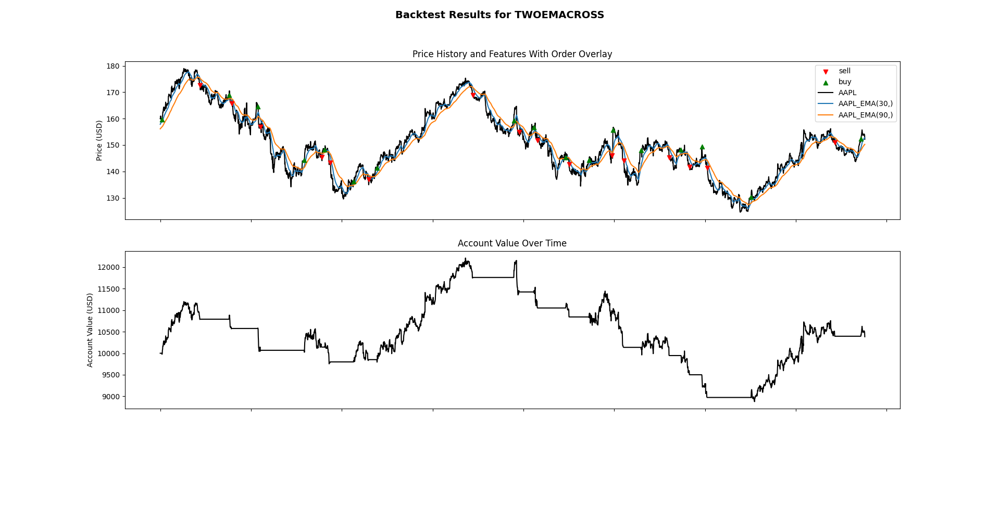

# What is this package?
I wanted to explore applying genetic algorithms to securities trading, a set of reinforcement learning algorithms that requires many agents to play at the same time. That feature is not available in most backtesting software, which means to try these algorithms one would have to backtest each agent serially, something that is prohibitive in computation and time. This package is built to enable that feature of testing many algorithms in parallel. This package is configured as the underlying backtest engine in standalone format (with out any algorithms beyond basic demonstration). See my other repository genetic_algorithm_trading for NEAT and other genetic algorithm experiements.

**Key features**
- Test multiple strategies at the same time
- Trade multiple securities with a single algorithm
- Example script includes demonstration of 

**Serious limitations**
- No options
- Live trading not yet implemented or tested
- No support for shorting

**Some tools this package uses:**
<!-- a list of the most important packages used here --> 
- Data handling and mathematics: numpy, pandas
- Data visualization: matplotlib
- Data source: polygon.io
- Brokerage: TDAmeritrade

**Some configurations available for tests**
- Slippage: execute orders at the next open, next close, a random value in the next candle
- Spread: set as a static percentage that is lost from the transaction value each buy order.
- Commission: set as a static percentage that is lost from the transaction value each buy order.

# Current status
This package is currently in development, and is largely made as a learning project. I likely will never use it to run real strategies as finding profitable algorithms in todays highly efficient markets is very difficult. 

However, this project can currently run backtests with a decent amount of configurability, and I've found it to be pretty fast to be able to implement and test new ideas. 

# Example output 
The below figure was generated by the `examples/simple_backtest.py` file for the stock AAPL, 2 years of data, buying and selling based on the 30 hour and 90 hour moving averages.


# How to Use This Package
## Install initial tools and pyenv
```
sudo apt update && sudo apt upgrade
sudo apt install curl

# These are required for pyenv
sudo apt-get install -y build-essential libssl-dev zlib1g-dev libbz2-dev libreadline-dev libsqlite3-dev wget curl llvm libncurses5-dev libncursesw5-dev xz-utils tk-dev libffi-dev liblzma-dev python-openssl git

curl https://pyenv.run | bash
```

## Configure pyenv
The following is required for pyenv to work.

Add the following to the top of the .bashrc file:

```
export PYENV_ROOT="$HOME/.pyenv"
export PATH="$PYENV_ROOT/bin:$PATH"
eval "$(pyenv init --path)"
```
Add the following to the top of the .bashrc file:
```
eval "$(pyenv init -)"
eval "$(pyenv virtualenv-init -)"
```
Now, restart the terminal, and run `pyenv` as initial test that pyenv was install


## Configure the environment and set up poetry

Ensure at this time that you have your pyproject.toml file in the root of your project and configured correctly with the poetry standards. If you're just trying to run the tests or examples, you can use the pyproject.toml file in this repo. Otherwise, you should have cloned this project, and you can define the path to this package in your pyproject.toml file.

Run the following commands to set up the environment and install poetry:
```
pyenv install 3.x.x
pyenv virtualenv 3.x.x <env_name>
pyenv local <env_name>
pip install poetry
poetry lock
poetry install
```

## Connecting to TDAmeritrade and Polygon APIs (brokerage and backtesting data)
The main function for getting data from polygon, "get_candle_data", takes the API key as a function parameter.

For TDAmeritrade, the set up is a little involved.
You will need to create a developer account with them, and then set the following environment variables:
```
export TDAMERITRADE_CONSUMER_KEY=<your consumer key>
export TDAMERITRADE_REDIRECT_URI=<your redirect uri>
export TDAMERITRADE_ACCOUNTNUMBER=<your account number>
```

Follow the Authentication Workflow defined at the [repository](https://github.com/areed1192/td-ameritrade-python-api).


## Setting up backtests
See the examples folder for examples of how to set up and run backtests, including definitions of an algorithm, importing data from polygon io, setting up common technical analysis indicators, running the backtest, and analyzing the performance of your algorithm.

## Running
Scripts can be run in the usual way with poetry:
```poetry run python <path to script>```


<!-- To propogate changes to dependent modules: appears incrementing version number and then poetry update is the only way -->

